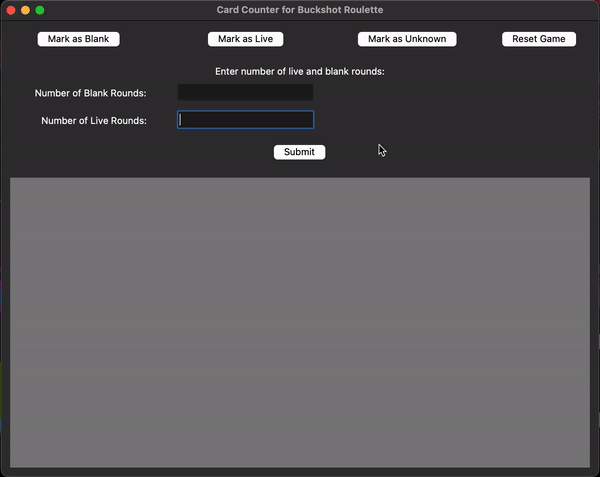

# Card Counter for Buckshot Roulette

This application helps you keep track of live and blank rounds in the game [Buckshot Roulette](https://buckshotroulette.online/steam/).

## Features

- Mark rounds as live or blank.
- Reset the game.
- Visual representation of live round likelihood and ratio of live to blank rounds.
- Packaged as a macOS app.

## Installation

Instructions for Running and Building the Application from Source with Visual Studio Code

### Install Dependencies

This application uses the following dependencies: 
- Python 3.x
- tkinter
- py2app (for packaging)

Ensure you have Python 3 installed on your Mac. You can check this by running:

    python3 --version
    

If you don't have Python 3, you can install it using Homebrew:

    brew install python
    

Next, install py2app for packaging your application:

    pip3 install py2app
    

### Clone or Download the Project

If you have a GitHub repository, clone it to your local machine:

    git clone https://github.com/lucian151/BuckshotRouletteCounter.git
    cd BuckshotRouletteCounter

If you have downloaded a ZIP file, unzip it and navigate to the extracted folder in the terminal.

### Open the Project in Visual Studio Code

Open Visual Studio Code and open the folder containing your project files:

1.  Launch Visual Studio Code.
2.  Go to `File -> Open Folder...` and select the folder with your project files.

### Set Up the Python Environment

Open the terminal in Visual Studio Code by selecting `Terminal -> New Terminal`.

Create a virtual environment for the project:

    python3 -m venv venv
    

Activate the virtual environment:

    source venv/bin/activate
    

Install the required dependencies within the virtual environment. Assuming `requirements.txt` includes necessary libraries, run:

    pip install -r requirements.txt

If you don't have a `requirements.txt` file, manually install tkinter (usually included with Python) and any other dependencies.

### Run the Application

Open the terminal in Visual Studio Code.

Run your application by executing:

    python main.py

### Debugging and Development

You can use Visual Studio Code's debugging features to set breakpoints, step through code, and inspect variables. To start debugging:

1.  Click on the debug icon in the sidebar or press `F5`.
2.  Configure the debugger if prompted (usually, the default configuration works for Python).

### Packaging the Application

If you want to package your application into a standalone macOS app:

1.  Create or update `setup.py` as outlined in previous instructions.
2.  Build the app by running the following command in the terminal:

        python setup.py py2app

After the build process completes, find the `.app` file in the `dist` directory.

## License

This project is licensed under the GPL-3.0 license - see the [LICENSE](LICENSE) file for details.