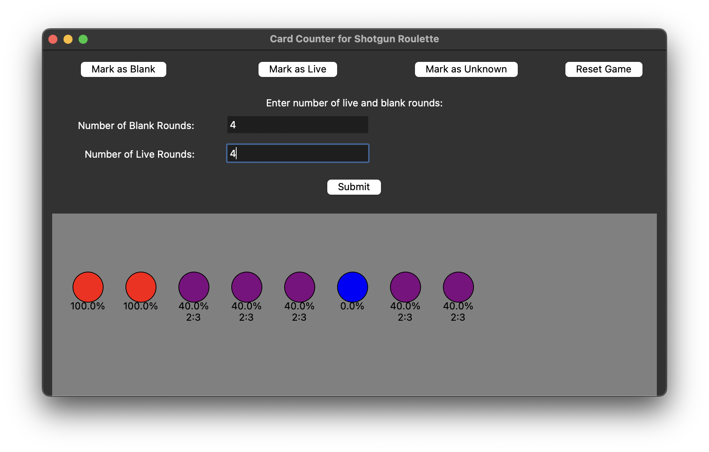

# Card Counter for Buckshot Roulette

This application helps you keep track of live and blank rounds in the game [Buckshot Roulette](https://buckshotroulette.online/steam/).

## Features

- Mark rounds as live or blank.
- Reset the game.
- Visual representation of live round likelihood and ratio of live to blank rounds.
- Packaged as a macOS app.




## Requirements

- Python 3.x
- tkinter
- py2app (for packaging)

## Installation

1. Clone this repository:
    ```bash
    git clone https://github.com/yourusername/BuckshotRouletteCounter.git
    ```
2. Navigate to the project directory:
    ```bash
    cd BuckshotRouletteCounter
    ```
3. Install required packages:
    ```bash
    pip install -r requirements.txt
    ```

## Packaging

To package the app for macOS:

1. Install py2app:
    ```bash
    pip install py2app
    ```
2. Run the setup script:
    ```bash
    python setup.py py2app
    ```

The packaged application will be located in the `dist` directory.

## License

This project is licensed under the GPL-3.0 license - see the [LICENSE](LICENSE) file for details.
